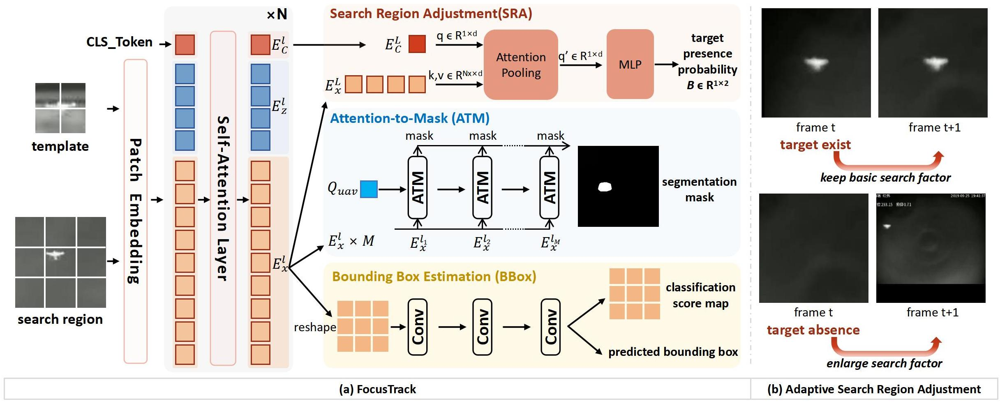
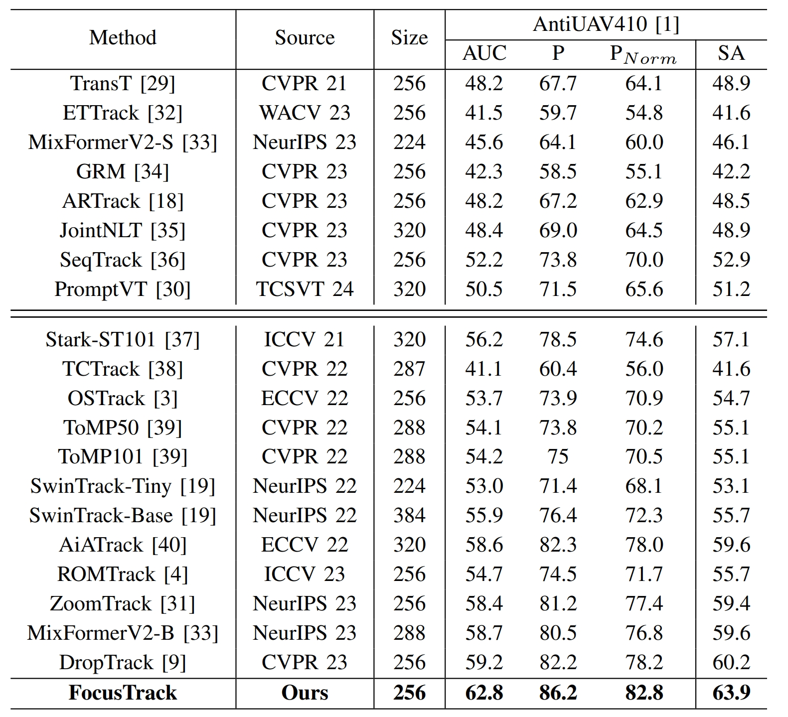

# ZoomTrack

This is the official implementation for the paper [FocusTrack: A Self-Adaptive Local Sampling Algorithm for Efficient Anti-UAV Tracking](https://arxiv.org/abs/2310.10071)


**models**: [Google Drive](https://drive.google.com/drive/folders/1ndhwjIIymsppHknSjLUd40NmPmQ4XZhi?usp=drive_link) / [百度云](https://pan.baidu.com/s/1vVNZtYes-V6HJS0bWh0DJA?pwd=1106)（提取码：1106）  
**raw_results**: [Google Drive](https://drive.google.com/drive/folders/1YmdjnSCKsmLKuGZ9MJysM7jiM8EUhQA2?usp=drive_link) / [百度云](
https://pan.baidu.com/s/1Kjve1UWZ7Ke2_Vq_Git42w?pwd=1106)（提取码：1106）





we evaluate 18 transformer-based local trackers on the AntiUAV410 test set. These trackers are divided into two groups. The upper section of the table presents results from original models reported in prior work. The lower section shows results from models retrained on the AntiUAV410 training set. Among them, OSTrack, ROMTrack, ZoomTrack, and DropTrack are retrained using their default configurations and official pre-trained weights. 
The results of all retrained models are available in the [Raw Results]() directory.




## Install the environment

We recommend using **conda** for environment management. The code has been tested with **CUDA 11.8** and **Python 3.9**.

### Step 1: Create a new environment
```bash
conda create -n focustrack python==3.9
conda activate focustrack
```

### Step 2: Install PyTorch with CUDA 11.8 support
```bash
conda install pytorch==2.0.0 torchvision==0.15.0 torchaudio==2.0.0 pytorch-cuda=11.8 -c pytorch -c nvidia
```

### Step 3: Install additional dependencies
```bash
pip install PyYAML easydict cython opencv-python pandas pycocotools jpeg4py tqdm \
tb-nightly tikzplotlib colorama lmdb scipy visdom timm tensorboardX beautifulsoup4 \
scikit-image huggingface_hub pytorch_pretrained_bert clip ftfy einops wandb cvxopt \
matplotlib==3.6 numpy==1.23.5
```

### Step 4: Install the VOT toolkit (for evaluation)
```bash
pip install git+https://github.com/votchallenge/vot-toolkit-python
```


## Set project paths
```
python tracking/create_default_local_file.py --workspace_dir . --data_dir ./data --save_dir ./output
```
After running this command, you can also modify paths by editing these two files
```
lib/train/admin/local.py  # paths about training
lib/test/evaluation/local.py  # paths about testing
```


## Data Preparation
Put the tracking datasets in ./data. It should look like this:
   ```
   ${PROJECT_ROOT}
    -- data
        -- antiuav410
            |-- train
                |-- 01_1667_0001-1500
                ...
                |-- list.txt
                |-- train.json
            |-- test
                |-- 02_6319_1500-2999
                ...
            |-- val
                |-- 03_7951_1500-2999
                ...
                |-- list.txt
                |-- val.json
        -- antiuav310
            |-- test
            |-- train
            |-- val
   ```

## Training
Download pre-trained [DropMAE] [Google Drive](https://drive.google.com/drive/folders/1VvXYmaA2U_Q60Qvu6_rXwP2g1mY29jFo?usp=drive_link) / [百度云](
https://pan.baidu.com/s/1irl-SPBiqjsEiNYo5Cx6Ow?pwd=1106)（提取码：1106） model and place it under `$PROJECT_ROOT$/pretrained_models`.


```
python tracking/train.py --script focustrack --config focustrack_single --save_dir ./output --mode multiple --nproc_per_node 4 --use_wandb 0 
```

Replace `--config` with the desired model config under `experiments/focustrack`. 


## Evaluation
Download the model weights and put the downloaded weights on `$PROJECT_ROOT$/output/checkpoints/train/focustrack`

Change the corresponding values of `lib/test/evaluation/local.py` to the actual benchmark saving paths


```
# for single stage
python tracking/test.py --tracker_name focustrack --tracker_param focustrack_single --dataset_name antiuav410_test --threads 6 --num_gpus 1 --run_id 30


# for two stage
python tracking/test.py --tracker_name focustrack --tracker_param focustrack_stage2 --dataset_name antiuav410_test --threads 6 --num_gpus 1 --run_id 10
```


## Visualization or Debug 
[Visdom](https://github.com/fossasia/visdom) is used for visualization. 
1. Alive visdom in the server by running `visdom`:

2. Simply set `--debug 1` during inference for visualization, e.g.:
```
python tracking/test.py --tracker_name focustrack --tracker_param focustrack_stage2 --dataset_name antiuav410_test --threads 6 --num_gpus 1 --run_id 10  --debug 1
```
3. Open `http://localhost:8097` in your browser (remember to change the IP address and port according to the actual situation).


## Acknowledgments
* Thanks for the [OSTrack](https://github.com/botaoye/OSTrack) and [PyTracking](https://github.com/visionml/pytracking) library, which helps us to quickly implement our ideas.
* We use the implementation of the ViT from the [Timm](https://github.com/rwightman/pytorch-image-models) repo.  


